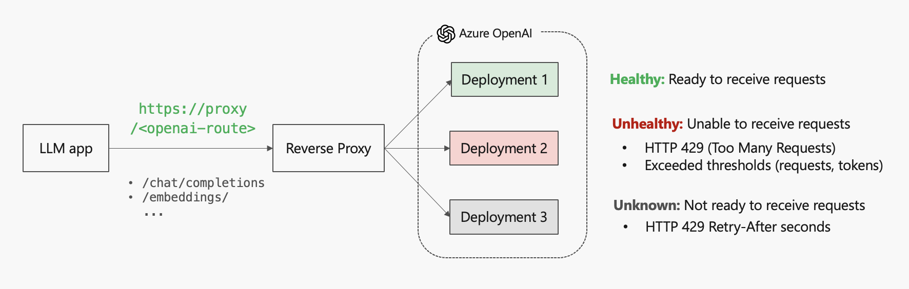

# Azure OpenAI Reverse Proxy

A [reverse proxy](https://en.wikipedia.org/wiki/Reverse_proxy) for distributing requests across OpenAI model deployments (e.g. GPT-4) hosted in Azure OpenAI Service (AOAI).



> [!IMPORTANT]
> This is a highly experimental solution, and it's not an official Microsoft product.

## Table of contents

- [Problem statement](#problem-statement)
- [Solution](#solution)
  - [Core features](#core-features)
  - [Passive Health Check](#passive-health-check)
- [Proxy configuration](#proxy-configuration)
- [Trying it out](#trying-it-out)
  - [Prerequisites](#prerequisites)
  - [App settings setup](#app-settings-setup)
  - [Running the solution](#running-the-solution)
  - [Testing the proxy](#testing-the-proxy)
  - [Environment teardown](#environment-teardown)
- [References](#references)

## Problem Statement

An Azure OpenAI deployment model throttling is designed taking into consideration two configurable rate limits:

- `Tokens-per-minute (TPM)`: Estimated number of tokens that can processed over a one-minute period
- `Requests-per-minute (RPM)`: Estimated number of requests over a one-minute period

A deployment model is considered overloaded when _at least_ one of these rate limits is reached, and Azure OpenAI returns an HTTP 429 ("Too Many Requests") response code to the client with a "Retry-After" HTTP header indicating how many seconds the deployment model will be unavailable before starting to accept more requests.

### Challenges

What if there is an increasing demand for requests and/or tokens that can't be met with the deployment model's rate limits? Currently the alternatives are:

1. Increase the model deployment capacity by requesting [Provisioned throughput units (PTU)](https://learn.microsoft.com/en-us/azure/ai-services/openai/concepts/provisioned-throughput).

2. Build a load balancing component to distribute the requests to the model deployments, hosted on a single or multiple Azure OpenAI resources, optimizing resources utilization and maximizing throughput.

3. Adopt a failover strategy by forwarding the requests from an overloaded model deployment to another one.

These approaches can be combined to achieve enhanced scalability, performance and availability.

## Solution

This repository showcases a proof-of-concept solution for the alternative #2: A reverse proxy built in ASP.NET Core with [YARP](https://microsoft.github.io/reverse-proxy/articles/getting-started.html).

### Core features

- YARP's built-in [load balancing algorithms](https://microsoft.github.io/reverse-proxy/articles/load-balancing.html#built-in-policies).

* Custom [passive health check](https://microsoft.github.io/reverse-proxy/articles/dests-health-checks.html#passive-health-checks) to reactively evaluate and assign states for Azure OpenAI model deployments. For more info, check out the [Passive Health Check](#passive-health-check) section.

### Passive Health Check

> WIP

## Proxy configuration

> WIP

## Trying it out

The repository provides the following containerized services out of the box to simplify local development:


### Prerequisites

- An Azure OpenAI Service with 2 or more model deployments. For more information about model deployment, see the [resource deployment guide](https://learn.microsoft.com/en-us/azure/ai-services/openai/how-to/create-resource?pivots=web-portal).
- [Docker](https://docs.docker.com/get-docker/), or [Podman](https://podman.io/docs/installation) with [podman-compose](https://github.com/containers/podman-compose).

### App settings setup

1. First, create an `appsettings.Local.json` file on `src/proxy` from the provided template file `appsettings.Template.json` and change the values to match your Azure OpenAI model deployments:

```
"Destinations": {
    "deployment1": {
      "Address": "https://account-name.openai.azure.com/openai/deployments/deployment-1"
    },
    "deployment2": {
      "Address": "https:///account-name.openai.azure.com/openai/deployments/deployment-2"
    }
  }
}
```

2. Create a `.env` file on the root directory and add the Azure OpenAI API key:

   ```
   AZURE_OPENAI_API_KEY=<api-key>
   ```

   > The `PROXY_ENDPOINT` environment variable is set by default on the `compose.yml` file.

### Running the solution

Spin services up with Docker compose:

```sh
docker-compose up
```

> [!IMPORTANT]
> For any code changes, make sure you build the image again before running using the `--build` flag:` docker-compose up --build`

### Testing the proxy

The repository provides the following ways of sending HTTP requests to Azure OpenAI Chat Completions API through the proxy:

1. Sequential requests via bash script, available on the `scripts` folder:

   ```
   ./scripts/client.sh
   ```

2. Concurrent requests via `k6`, a load testing tool:

   ```
   docker-compose run k6 run /scripts/client.js
   ```

### Environment teardown

For stopping and removing the containers, networks, volumes and images:

```
docker-compose down --volumes --rmi all
```

## References

- [Understanding rate limits](https://learn.microsoft.com/en-us/azure/ai-services/openai/how-to/quota?tabs=rest#understanding-rate-limits)

* [OpenAI: Rate limits in headers](https://platform.openai.com/docs/guides/rate-limits/rate-limits-in-headers)
